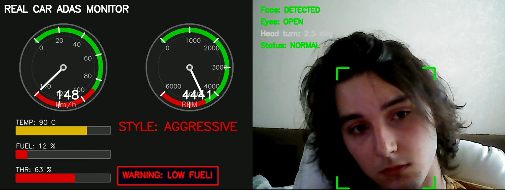

# Real Car ADAS Monitor

Система мониторинга автомобиля в реальном времени, разработанная на C++ в рамках курса «Программная инженерия».

##  Описание

Система одновременно:
- Отображает телеметрию OBD-II (скорость, обороты, температура, топливо) на приборной панели
- Анализирует состояние водителя через веб-камеру (усталость, отвлечение)
- Классифицирует стиль вождения (SLOW / NORMAL / AGGRESSIVE) с помощью нейросети ONNX
- Работает в многопоточном режиме в реальном времени

##  Архитектура
─────────────────────────────────────────────────────────┐
│ REAL CAR ADAS MONITOR │
├────────────────────────────┬────────────────────────────┤
│ ПОТОК 1: OBD Thread │ ПОТОК 2: Main Thread │
│ (10 Hz) │ (30 FPS) │
│ • Читает CSV │ • Читает веб-камеру │
│ • Классифицирует стиль │ • Анализирует водителя │
│ • Пишет в SharedState │ • Рисует кадр 1280×480 │
│ │ • Пишет видео и лог │
────────────────────────────┴────────────────────────────


##  Стек технологий

| Компонент | Технология | Версия |
|-----------|------------|--------|
| Язык программирования | C++ | 17 |
| Сборка | CMake | 3.20+ |
| Компилятор | MSVC (Visual Studio 2026) | 19.4+ |
| Компьютерное зрение | OpenCV | 4.13.0 |
| ML inference | ONNX Runtime | 1.19.0 |
| Нейросеть | PyTorch (обучение) | 2.x |
| Unit-тесты | Google Test | 1.12.1 |
| Документация | Doxygen | 1.9+ |
| Хранение кода | Git + GitHub | - |

##  Сборка

## Требования
- Windows 10/11
- Visual Studio Build Tools 2022/2026
- CMake 3.20+
- OpenCV 4.x (установлен в `C:\opencv`)
- ONNX Runtime (распакован в `C:\onnxruntime`)

## Команды сборки

```bash
mkdir build
cd build
cmake .. -G "Visual Studio 18 2026" -A x64
cmake --build . --config Release
```

## Запуск
```bash
cd build
.\Release\RealCarMonitor.exe
```


## Скриншот ситстемы 




##  Таблица результатов
Точность на тестовой выборке (Colab)  =  92.10 %
Точность на первых 20 записях CSV  = 85%
Количество тестовых данных  =  5000 записей
Частота OBD-потока = 10 Hz (каждые 100 мс)
Частота видео = 15 FPS (запись), 30 FPS (камера)
Разрешение кадра = 1280 × 480 пикселей
Размер приборной панели = 640 × 480 пикселей

## Пример тестовой сессии 
```bash
=== SESSION STATISTICS ===
Duration:        128 seconds
OBD processed:   1175 records
Total alerts:    1031
  Drowsy:        887
  Distracted:    144
  Aggressive:    393
```


## Автор
Студент группы 254-931
Мансуров А. Р.
2026 год
